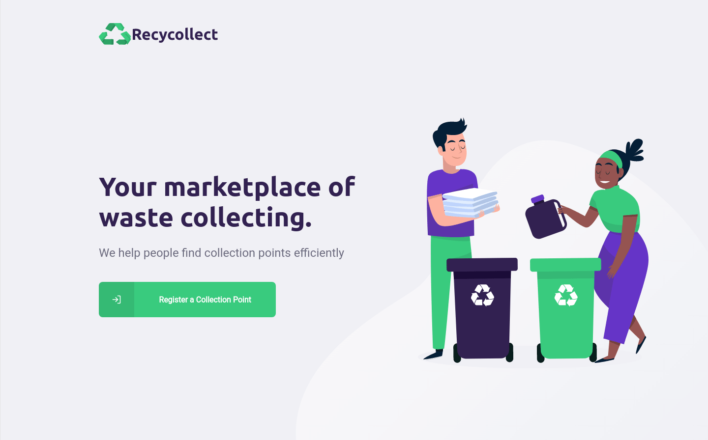
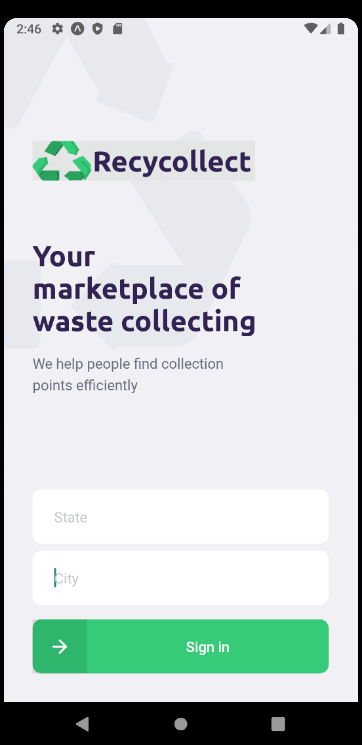

# recycollect

A full stack javascript (backend, frontend and mobile) project about recycling and waste collecting

## Web



## Mobile



# Running

To execute the project, go to each module and type the commands:

### Server

```sh
npm run dev
```

### Front End

```sh
npm run start
```

or

```sh
yarn start
```

### Mobile

```sh
npm run start
```

or

```sh
yarn start
```
